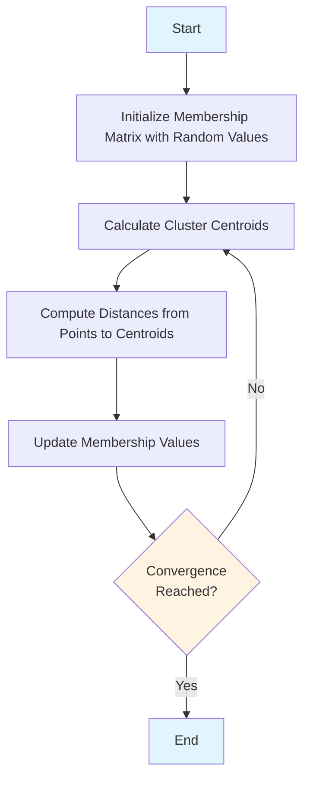

# Fuzzy C-Means Clustering

## Introduction

Fuzzy C-Means (FCM) is a soft clustering algorithm where each data point can belong to multiple clusters with varying degrees of membership. Unlike hard clustering methods like K-Means where each point belongs to exactly one cluster, FCM allows partial memberships, making it more flexible for handling overlapping clusters.

The algorithm iteratively updates cluster centroids and membership values until convergence is achieved.

## Algorithm Overview

## Algorithm Steps

### Step 1: Initialize Membership Matrix

Given the data points and the desired number of clusters, initialize a membership matrix with random values between 0 and 1. Each row represents a cluster, and each column represents a data point.

**Constraints:**
- Membership values must be between 0 and 1
- For each data point, the sum of memberships across all clusters must equal 1

### Step 2: Calculate Cluster Centroids

Calculate the centroid (center) of each cluster using the weighted average of all data points.

**Formula:**

$$V_{ij} = \frac{\sum_{k=1}^{n} \gamma_{ik}^m \cdot x_k}{\sum_{k=1}^{n} \gamma_{ik}^m}$$

Where:
- $V_{ij}$ is the $j$-th coordinate of the $i$-th cluster centroid
- $\gamma$ (gamma) is the fuzzy membership value
- $m$ is the fuzziness parameter (typically set to 2)
- $x_k$ is the data point
- $n$ is the total number of data points

### Step 3: Calculate Distances

Compute the Euclidean distance between each data point and each cluster centroid.

**Formula:**

$$D_{ki} = \sqrt{(x_k - V_{i1})^2 + (y_k - V_{i2})^2}$$

Where:
- $D_{ki}$ is the distance from point $k$ to centroid $i$
- $(x_k, y_k)$ is the data point
- $(V_{i1}, V_{i2})$ is the cluster centroid

### Step 4: Update Membership Values

Update the membership values based on the calculated distances.

**Formula:**

$$\gamma_{ki} = \left(\sum_{j=1}^{n} \left\{\frac{d_{ki}^2}{d_{kj}^2}\right\}^{\left(\frac{1}{m-1}\right)}\right)^{-1}$$

Where:
- $\gamma_{ki}$ is the membership of point $k$ in cluster $i$
- $d_{ki}$ is the distance from point $k$ to centroid $i$
- $m$ is the fuzziness parameter (typically 2)

### Step 5: Check Convergence

Repeat steps 2-4 until one of the following convergence criteria is met:
- The membership values remain constant (or change is negligible)
- The difference between consecutive iterations is less than a tolerance value (e.g., 0.01)
- A maximum number of iterations is reached

## Detailed Example

### Given Data

Data points: **{(1, 3), (2, 5), (4, 8), (7, 9)}**

Number of clusters: **2**

Fuzziness parameter: **m = 2**

### Iteration 1

#### Step 1: Initial Membership Matrix

| Cluster | (1, 3) | (2, 5) | (4, 8) | (7, 9) |
|---------|--------|--------|--------|--------|
| 1       | 0.8    | 0.7    | 0.2    | 0.1    |
| 2       | 0.2    | 0.3    | 0.8    | 0.9    |

#### Step 2: Calculate Centroids

**For Cluster 1 (x-coordinate):**

$$V_{11} = \frac{0.8^2 \cdot 1 + 0.7^2 \cdot 2 + 0.2^2 \cdot 4 + 0.1^2 \cdot 7}{0.8^2 + 0.7^2 + 0.2^2 + 0.1^2}$$

$$V_{11} = \frac{0.64 \cdot 1 + 0.49 \cdot 2 + 0.04 \cdot 4 + 0.01 \cdot 7}{0.64 + 0.49 + 0.04 + 0.01} = \frac{1.85}{1.18} = 1.568$$

**For Cluster 1 (y-coordinate):**

$$V_{12} = \frac{0.8^2 \cdot 3 + 0.7^2 \cdot 5 + 0.2^2 \cdot 8 + 0.1^2 \cdot 9}{0.8^2 + 0.7^2 + 0.2^2 + 0.1^2}$$

$$V_{12} = \frac{0.64 \cdot 3 + 0.49 \cdot 5 + 0.04 \cdot 8 + 0.01 \cdot 9}{1.18} = \frac{4.78}{1.18} = 4.051$$

**For Cluster 2 (x-coordinate):**

$$V_{21} = \frac{0.2^2 \cdot 1 + 0.3^2 \cdot 2 + 0.8^2 \cdot 4 + 0.9^2 \cdot 7}{0.2^2 + 0.3^2 + 0.8^2 + 0.9^2}$$

$$V_{21} = \frac{0.04 \cdot 1 + 0.09 \cdot 2 + 0.64 \cdot 4 + 0.81 \cdot 7}{0.04 + 0.09 + 0.64 + 0.81} = \frac{8.45}{1.58} = 5.35$$

**For Cluster 2 (y-coordinate):**

$$V_{22} = \frac{0.2^2 \cdot 3 + 0.3^2 \cdot 5 + 0.8^2 \cdot 8 + 0.9^2 \cdot 9}{0.2^2 + 0.3^2 + 0.8^2 + 0.9^2}$$

$$V_{22} = \frac{0.04 \cdot 3 + 0.09 \cdot 5 + 0.64 \cdot 8 + 0.81 \cdot 9}{1.58} = \frac{12.98}{1.58} = 8.215$$

**Centroids:** (1.568, 4.051) and (5.35, 8.215)

#### Step 3: Calculate Distances

**Distances from each point to Centroid 1 (1.568, 4.051):**
- $D_{11} = \sqrt{(1 - 1.568)^2 + (3 - 4.051)^2} = 1.2$
- $D_{21} = \sqrt{(2 - 1.568)^2 + (5 - 4.051)^2} = 1.04$
- $D_{31} = \sqrt{(4 - 1.568)^2 + (8 - 4.051)^2} = 4.63$
- $D_{41} = \sqrt{(7 - 1.568)^2 + (9 - 4.051)^2} = 7.34$

**Distances from each point to Centroid 2 (5.35, 8.215):**
- $D_{12} = \sqrt{(1 - 5.35)^2 + (3 - 8.215)^2} = 6.79$
- $D_{22} = \sqrt{(2 - 5.35)^2 + (5 - 8.215)^2} = 4.64$
- $D_{32} = \sqrt{(4 - 5.35)^2 + (8 - 8.215)^2} = 1.36$
- $D_{42} = \sqrt{(7 - 5.35)^2 + (9 - 8.215)^2} = 1.82$

#### Step 4: Update Membership Values

**For Point 1 (1, 3):**

$$\gamma_{11} = \left(\frac{(1.2)^2}{(1.2)^2} + \frac{(1.2)^2}{(6.79)^2}\right)^{-1} = 0.97$$

$$\gamma_{12} = \left(\frac{(6.79)^2}{(1.2)^2} + \frac{(6.79)^2}{(6.79)^2}\right)^{-1} = 0.03$$

**For Point 2 (2, 5):**

$$\gamma_{21} = \left(\frac{(1.04)^2}{(1.04)^2} + \frac{(1.04)^2}{(4.64)^2}\right)^{-1} = 0.95$$

$$\gamma_{22} = \left(\frac{(4.64)^2}{(1.04)^2} + \frac{(4.64)^2}{(4.64)^2}\right)^{-1} = 0.05$$

**For Point 3 (4, 8):**

$$\gamma_{31} = \left(\frac{(4.63)^2}{(4.63)^2} + \frac{(4.63)^2}{(1.36)^2}\right)^{-1} = 0.08$$

$$\gamma_{32} = \left(\frac{(1.36)^2}{(4.63)^2} + \frac{(1.36)^2}{(1.36)^2}\right)^{-1} = 0.92$$

**For Point 4 (7, 9):**

$$\gamma_{41} = \left(\frac{(7.34)^2}{(7.34)^2} + \frac{(7.34)^2}{(1.82)^2}\right)^{-1} = 0.06$$

$$\gamma_{42} = \left(\frac{(1.82)^2}{(7.34)^2} + \frac{(1.82)^2}{(1.82)^2}\right)^{-1} = 0.94$$

**Updated Membership Matrix:**

| Cluster | (1, 3) | (2, 5) | (4, 8) | (7, 9) |
|---------|--------|--------|--------|--------|
| 1       | 0.97   | 0.95   | 0.08   | 0.06   |
| 2       | 0.03   | 0.05   | 0.92   | 0.94   |

### Step 5: Convergence Check

Compare the updated membership values with the initial values. If the maximum change is less than the tolerance (e.g., 0.01), stop. Otherwise, repeat steps 2-4 with the new membership values.

In this example, the changes are significant (e.g., point 1 changed from 0.8 to 0.97), so we would continue iterating until convergence.

## Key Concepts

### Fuzziness Parameter (m)

The fuzziness parameter controls how "fuzzy" the clusters are:
- **m = 1**: Hard clustering (equivalent to K-Means)
- **m = 2**: Standard fuzzy clustering (most commonly used)
- **m > 2**: More fuzziness, points can belong equally to multiple clusters

### Membership Interpretation

For a point with memberships [0.97, 0.03]:
- The point belongs 97% to cluster 1
- The point belongs 3% to cluster 2
- This indicates strong membership in cluster 1

## Applications

Fuzzy C-Means is widely used in:
- Image segmentation
- Pattern recognition
- Bioinformatics
- Customer segmentation
- Medical diagnosis
- Data analysis with overlapping categories

## Advantages

1. **Soft clustering**: Points can belong to multiple clusters
2. **Flexibility**: Better handles overlapping clusters
3. **Robustness**: Less sensitive to initialization than hard clustering
4. **Interpretability**: Membership degrees provide additional information

## Limitations

1. **Convergence**: May converge to local optima
2. **Cluster number**: Requires pre-specification of the number of clusters
3. **Computational cost**: More expensive than K-Means
4. **Noise sensitivity**: Sensitive to outliers and noise

## Summary

Fuzzy C-Means is an iterative algorithm that:
1. Initializes membership values randomly
2. Calculates cluster centroids based on weighted memberships
3. Computes distances from points to centroids
4. Updates membership values based on distances
5. Repeats until convergence

The algorithm produces soft cluster assignments where each data point has a membership degree to each cluster, providing a more nuanced view of the data structure compared to hard clustering methods.
