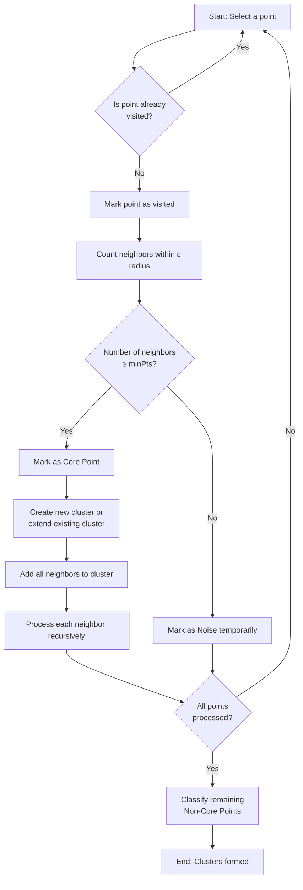
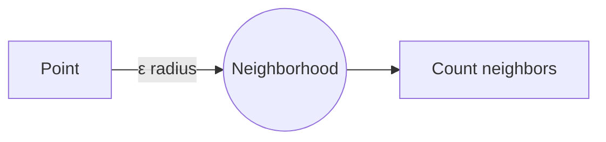
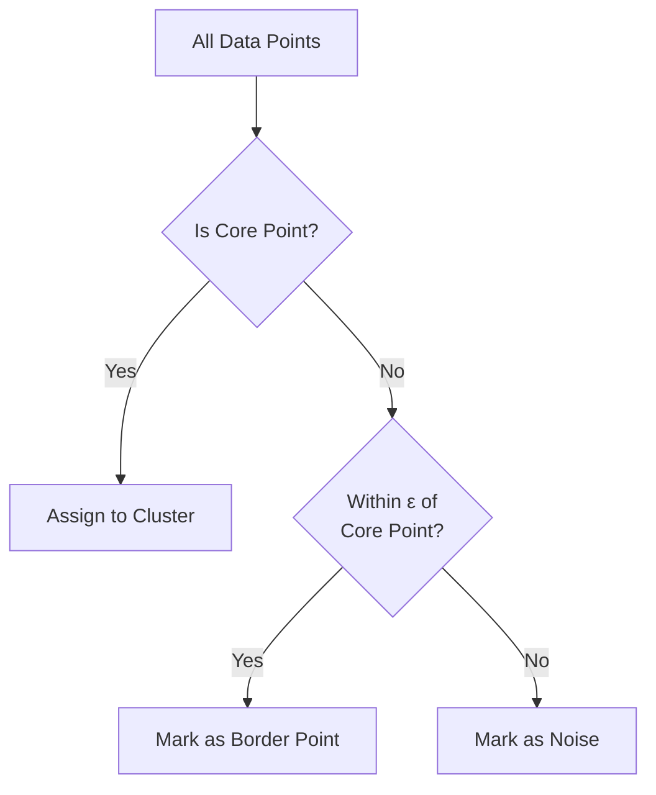
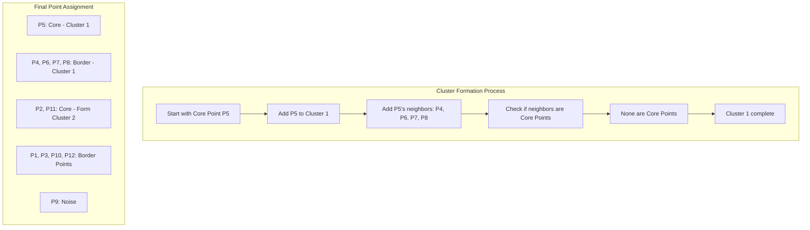

# DBSCAN Clustering Algorithm Lab

## Introduction

DBSCAN (Density-Based Spatial Clustering of Applications with Noise) is a density-based clustering algorithm that groups together points that are closely packed together. Unlike K-Means, DBSCAN does not require you to specify the number of clusters beforehand and can identify outliers as noise.

## Key Concepts

### 1. Core Points
A point is classified as a **Core Point** if it has at least `minPts` points within a distance of `ε` (epsilon) from it, including itself.

### 2. Border Points
A point is classified as a **Border Point** if it:
- Is not a Core Point itself
- Lies within the ε-neighborhood of at least one Core Point

### 3. Noise Points
A point is classified as a **Noise Point** (outlier) if it is neither a Core Point nor a Border Point.

## Algorithm Parameters

DBSCAN requires two user-defined parameters:

1. **ε (epsilon)**: The radius of the circle (neighborhood) around each point
   - Points within this distance are considered neighbors
   - Needs to be tuned based on the dataset

2. **minPts**: The minimum number of points required to form a dense region (cluster)
   - A point is a Core Point if it has at least `minPts` neighbors within ε distance
   - Needs to be tuned based on the dataset

## Algorithm Workflow



## DBSCAN Step-by-Step Process

### Step 1: Count Neighbors
For each point in the dataset, count the number of points that fall within a distance of ε (the radius of the orange circle).



### Step 2: Identify Core Points
Points with at least `minPts` neighbors (including themselves) within ε radius are marked as **Core Points**.

### Step 3: Form Clusters
Starting from a Core Point:
- Create a new cluster
- Add all its neighbors to the cluster
- For each neighbor that is also a Core Point, add its neighbors to the cluster
- Continue until no more Core Points can be added to the cluster

### Step 4: Classify Non-Core Points
After all Core Points are assigned to clusters:
- Points within ε distance of any Core Point become **Border Points** of that cluster
- Points not close to any Core Point are classified as **Noise**



## Important Notes

- The radius ε is **user-defined**. When using DBSCAN, you may need to experiment with this parameter to find the optimal value for your dataset.

- The minimum number of points for a Core Point (`minPts`) is **user-defined**. You may need to adjust this parameter as well.

- Non-Core Points that are within ε distance of a Core Point do not extend the cluster further. Only Core Points can expand clusters.

## Distance Calculation

DBSCAN uses **Euclidean distance** to measure the distance between points:

For two points A(x₁, y₁) and B(x₂, y₂), the distance is:

```
Distance(A, B) = √[(x₂ - x₁)² + (y₂ - y₁)²]
```

---

## Solved Example

### Problem Statement
Apply the DBSCAN algorithm to the given data points and create clusters with:
- **minPts = 4**
- **ε (epsilon) = 1.9**

### Dataset

| Point | Coordinates |
|-------|-------------|
| P1    | (3, 7)      |
| P2    | (4, 6)      |
| P3    | (5, 5)      |
| P4    | (6, 4)      |
| P5    | (7, 3)      |
| P6    | (6, 2)      |
| P7    | (7, 2)      |
| P8    | (8, 4)      |
| P9    | (3, 3)      |
| P10   | (2, 6)      |
| P11   | (3, 5)      |
| P12   | (2, 4)      |

### Step 1: Calculate Distance Matrix

Using Euclidean distance formula, calculate the distance between all pairs of points:

|     | P1   | P2   | P3   | P4   | P5   | P6   | P7   | P8   | P9   | P10  | P11  | P12  |
|-----|------|------|------|------|------|------|------|------|------|------|------|------|
| P1  | 0    | 1.41 | 2.83 | 4.24 | 5.66 | 5.83 | 6.40 | 5.83 | 4.00 | 1.41 | 2.00 | 3.16 |
| P2  | 1.41 | 0    | 1.41 | 2.83 | 4.24 | 4.47 | 5.00 | 4.47 | 3.16 | 2.00 | 1.41 | 2.83 |
| P3  | 2.83 | 1.41 | 0    | 1.41 | 2.83 | 3.16 | 3.61 | 3.16 | 2.83 | 3.16 | 2.00 | 3.16 |
| P4  | 4.24 | 2.83 | 1.41 | 0    | 1.41 | 2.00 | 2.24 | 2.00 | 3.16 | 4.47 | 3.16 | 4.00 |
| P5  | 5.66 | 4.24 | 2.83 | 1.41 | 0    | 1.41 | 1.00 | 1.41 | 4.00 | 5.83 | 4.47 | 5.10 |
| P6  | 5.83 | 4.47 | 3.16 | 2.00 | 1.41 | 0    | 1.00 | 2.83 | 3.16 | 5.66 | 4.24 | 4.47 |
| P7  | 6.40 | 5.00 | 3.61 | 2.24 | 1.00 | 1.00 | 0    | 2.24 | 4.12 | 6.40 | 5.00 | 5.39 |
| P8  | 5.83 | 4.47 | 3.16 | 2.00 | 1.41 | 2.83 | 2.24 | 0    | 5.10 | 6.32 | 5.10 | 6.00 |
| P9  | 4.00 | 3.16 | 2.83 | 3.16 | 4.00 | 3.16 | 4.12 | 5.10 | 0    | 3.16 | 2.00 | 1.41 |
| P10 | 1.41 | 2.00 | 3.16 | 4.47 | 5.83 | 5.66 | 6.40 | 6.32 | 3.16 | 0    | 1.41 | 2.00 |
| P11 | 2.00 | 1.41 | 2.00 | 3.16 | 4.47 | 4.24 | 5.00 | 5.10 | 2.00 | 1.41 | 0    | 1.41 |
| P12 | 3.16 | 2.83 | 3.16 | 4.00 | 5.10 | 4.47 | 5.39 | 6.00 | 1.41 | 2.00 | 1.41 | 0    |

### Step 2: Identify Neighbors (ε = 1.9)

For each point, identify neighbors within ε = 1.9 distance:

| Point | Neighbors within ε = 1.9 |
|-------|--------------------------|
| P1    | P2, P10                  |
| P2    | P1, P3, P11              |
| P3    | P2, P4                   |
| P4    | P3, P5                   |
| P5    | P4, P6, P7, P8           |
| P6    | P5, P7                   |
| P7    | P5, P6                   |
| P8    | P5                       |
| P9    | P12                      |
| P10   | P1, P11                  |
| P11   | P2, P10, P12             |
| P12   | P9, P11                  |

### Step 3: Classify Points

With **minPts = 4**, a point is a Core Point if it has at least 4 neighbors (including itself) within ε distance.

**Core Points Identification:**
- P1: 2 neighbors → Not Core (Noise/Border)
- **P2**: 3 neighbors → Not Core (Noise/Border)
- P3: 2 neighbors → Not Core (Noise/Border)
- P4: 2 neighbors → Not Core (Noise/Border)
- **P5**: 4 neighbors → **CORE POINT** ✓
- P6: 2 neighbors → Not Core (Noise/Border)
- P7: 2 neighbors → Not Core (Noise/Border)
- P8: 1 neighbor → Not Core (Noise/Border)
- P9: 1 neighbor → Not Core (Noise/Border)
- P10: 2 neighbors → Not Core (Noise/Border)
- **P11**: 3 neighbors → Not Core (Noise/Border)
- P12: 2 neighbors → Not Core (Noise/Border)

**Note**: Only P2, P5, and P11 have exactly 3 or 4 neighbors. With minPts=4, only **P5 is a Core Point** (has 4 neighbors: P4, P6, P7, P8).

### Step 4: Final Classification

| Point | Status        | Type   |
|-------|---------------|--------|
| P1    | Noise         | Border |
| P2    | Core          |        |
| P3    | Noise         | Border |
| P4    | Noise         | Border |
| P5    | **Core**      |        |
| P6    | Noise         | Border |
| P7    | Noise         | Border |
| P8    | Noise         | Border |
| P9    | Noise         |        |
| P10   | Noise         | Border |
| P11   | Core          |        |
| P12   | Noise         | Border |

**Result**: 
- Core Points: P2, P5, P11
- Border Points: Points within ε of core points but not core themselves
- Noise Points: P9 (not within ε of any core point)

### Clustering Process Visualization



---

## Key Takeaways

1. DBSCAN automatically discovers the number of clusters based on data density
2. It can identify outliers as noise points
3. The algorithm requires careful tuning of ε and minPts parameters
4. Core Points drive cluster formation; Non-Core Points only join existing clusters
5. DBSCAN works well with clusters of arbitrary shapes, unlike K-Means

## Advantages of DBSCAN

- Does not require specifying the number of clusters
- Can find arbitrarily shaped clusters
- Robust to outliers (identifies them as noise)
- Only requires two parameters (ε and minPts)

## Disadvantages of DBSCAN

- Sensitive to parameter selection (ε and minPts)
- Struggles with clusters of varying densities
- Performance decreases with high-dimensional data
- Cannot cluster datasets well with large differences in density

---

## Practice Exercise

Try applying DBSCAN with different parameter values:
1. Experiment with ε = 2.5 and minPts = 3
2. Compare the resulting clusters with the example above
3. Observe how parameter changes affect cluster formation

